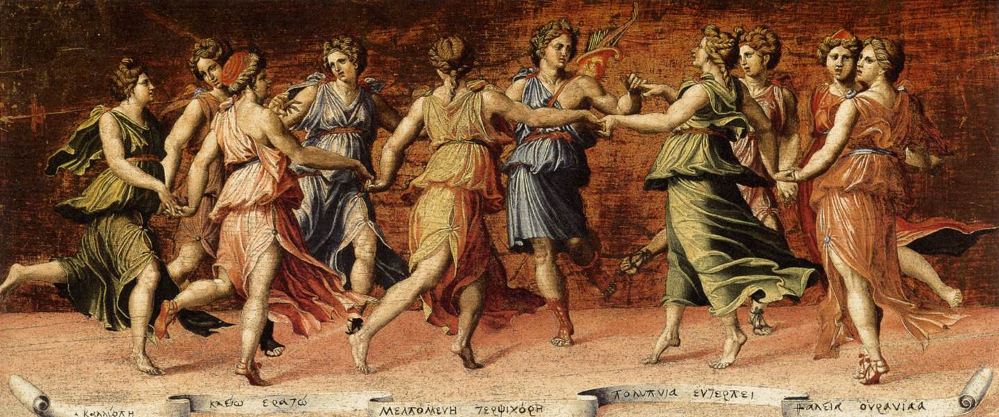

> *I want to be a writer, so I'm going to take XYZ workshops and read up how to become a writer and brainstorm ideas.*

> *I want to be a painter, so I’m going to work on XYZ fundamentals and think of what to draw.*

> *I want to make a business, so I’m going read XYZ books and then brainstorm ABC products.*

Normal statements, right? 

After all, it's how we’re trained since young. To visualize outcomes, set goals, research process, and engage process. This approach works, otherwise it wouldn't be so widespread.

But it only works for mechanical processes, or the very beginnings of an art. In the sustained pursuit of any art - business, sports, music - this approach is extremely limiting.

For most people, working out to stay healthy and look more attractive is a mechanical process. There are clear inputs that lead to clear outputs. You do the research, take the steps, and execute.

But if you're making an art out of working out - say, you're trying to become a Ronnie Coleman or a Bruce Lee, there is no plan. You're operating inside primordial chaos.

The expectation that efficacy comes from following that one reads in a book is a great lie of modernity. It's why self help is a multi-billion dollar industry. Goal setting is distracting at its best, onanism at its worst.

###"Writing is a disease and I suffer when I do not write"

Let's go back to the statements before and flip them around.

> *I have to write about this idea.*

> *I have to draw this thing that I see in front of me.*

> *I have to create this and sell it.*

The first group of statements come from the desire to be some 'type' of person. In order to be this type of person I will do the activities that this type of person does.

In other words, they come from a desire for attention.

The latter group are pure compulsion. Call it obsession or whatever you want. 

###The Muse is OUT Today

*You get these in your head at level 50*

The Iliad begins with the speaker of the poem invoking the Muse, asking her to sing the epic **through** him. 

Socrates claimed to have a "daimion", a divine something that told him what to do.

Is it true that only some are born obsessed? 

I don't think so.

The idea of the muse does these people a disservice. For all of their otherworldly ability, they are incredibly human. 

Their internal dialogue just spoke louder to them than usual.

I argue that your **genes** always know what they want. 

The process of growing up is separating this from what is expected of you.

This happens at every level of human existence. We exist inside massive fractals of thought patterns our entire live.

In finding your own voice, singing with your own voice, exploring the world with your own find, the only how-to is <b>there is no how-to</b>. Engaging process is fluid, chthonian, messy.

One thing is clear to me: you don't get where you want when you start with the desire for attention. 

###Maybe you will alienate people and that is okay.

*This is what compulsion looks like.*

A lot of life is built around attention-seeking.

People read how-tos so they can write how-tos. Round and round it goes. You can genuine assess interest in a topic with a glance.

My only question is...what actually compels you?

You might not know.

But when know you know. It’ll hit you like a rock and your brain will explode when the neurons are suddenly all going off at the same time and you realize you’ve been starved, like a traveler in a barren desert seeing water for the very first time.

