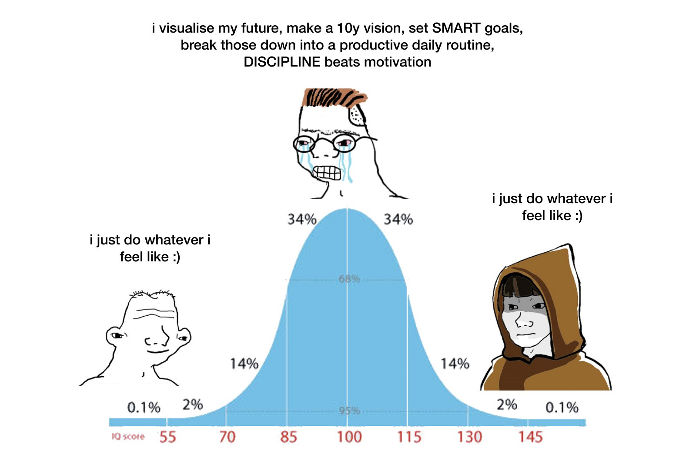

###Linearity and Anxiety

> *I want to be a writer, so I'm going to take XYZ workshops and read ABC books on writing and brainstorm AlphaBetaGamma ideas.*

> *I want to be a painter, so I’m going to work on XYZ fundamentals and think of ABC things to draw.*

> *I want to make a business, so I’m going read XYZ books and then brainstorm ABC products.*

These are very normal statements.

They echo our training since young: visualize outcomes, set goals, research process, engage process. The training works, otherwise it wouldn't be so widespread.

But here's what people miss: it only works for mechanical processes.

Working out to stay healthy and look more attractive is a mechanical process. There are clear inputs that lead to clear outputs. You do the research, you execute, you feel good.

But if you're making an art out of working out - say, you're trying to become a Big Ramy or a Bruce Lee, there's no deterministic function, because there is simply no precedent.

And don't we want to make an art out of our endeavors (even if secretly)? Whether that's in business, sport, games, poetry or any activity under the sun, the desire to scale new mountains, to acquire the boon through the journey, to expand into physical and mental space, is very human.

The expectation that performance comes from a book, from tweets, from a reading list however, is the great lie of modernity. It's why self help is a multi-billion dollar industry. In such a context, goal setting is distracting at its best, onanism at its worst.

###"Suffer like a bastard when don't write, or just before"

Let's go back to the statements before and flip them around.

> *I have to write about this idea.*

> *I have to draw this thing that I see in front of me.*

> *I have to create this and sell it.*

The earlier statements come from the desire to be some 'type' of person. In order to be this type of person, I will do the activities that this type of person does.

In other words, they come from a desire for attention.

The latter group come from compulsion. Call it obsession, or whatever you want. Compulsion doesn't need the little dopamine hits that come with self-perception.

One thing is clear to me: you don't get where you want when you start with the desire for attention. 

###The Muse is OUT Today and Always

The Iliad begins with the speaker of the poem invoking the Muse, asking her to sing the epic **through** him. 

Socrates claimed to have a "daimon", a divine something that told him what to do.

Is it true that only some are born obsessed? 

No.

The idea of the muse does these people a disservice. For all their otherworldly abilities, they are incredibly human. Their internal dialogue just speaks louder to them.

Your **genes** always know what they want. 

The process of growing up is separating this from what is expected of you. We can never truly get away from expectations - we exist inside monolithic thought patterns our entire live.

This means that in finding your own voice, singing with your own voice, the only how-to is <b>there is no</b> how-to. Engaging process is fluid, chthonian, messy, unprocessed, unlinear, pinball-ish.

###Maybe your compulsion will alienate people. Maybe that is alright.

A lot of life is built around attention-seeking. People read how-tos so they can write how-tos. Round and round we go.

What actually compels you? 

You might not know.

But when you know you know. 

It’ll hit you like a rock and your brain will explode when the neurons are suddenly all firing at the same time and you realize you’ve been starved, like a traveler in a barren desert gulping down a glass of crystal clear cold water.

And you'll see you were never "on the way there". 

It was always in you.
