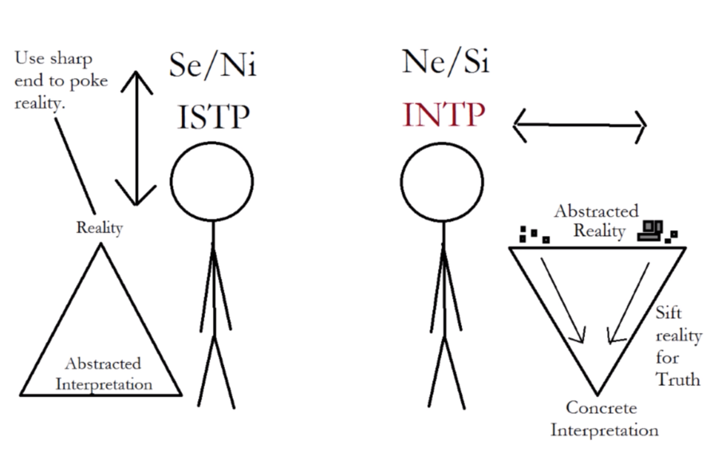

Let me set the scene. It's a sunny Sunday afternoon. I am peacefully reading *SPIN Selling* as part of a plan to improve my copywriting. Suddenly, the author Neil Rackham reaches a hand outside of the book and slaps me in the face:

> No book on selling will, of itself, improve your selling skills, any more than reading a book about swimming will teach you how to swim.

Oh no.

> **Entelechy.**..means the becoming actual of what was potential—turning something into practical usefulness as opposed to theoretical elegance.

Aw man.

> You've already demonstrated ability...in acquiring knowledge about how to sell. Yet, I wonder how many readers will invest an equivalent amount of effort in turning their knowledge into practice.

Oof. 

You know your audience well, Rackham. 

You know me well.

I've realized that I'm happiest when I achieve a balance between building **systems and models** in my head and using them to improve **outcomes in my life.**

If I'm not viligant about it, I don't achieve this balance. The pendulum swings too far in either direction:

**Completely practical:** Improving outcomes in life becomes a rote and mechanical process by which little new knowledge is obtained, and brings diminishing returns to happiness.

**Completely theoretical:** I build and nagivate mental models, feeling like I am more competent, when the truth is I don't know whether or not my models will survive the encounter with cold hard reality.

## Your Ni is messing with My Se

This looks suspiciously similar to one of the distinctions that the Myers-Briggs proponents like talk about.

*Looking at stick figure triangle diagrams that have little practical use. Classic Ne!*