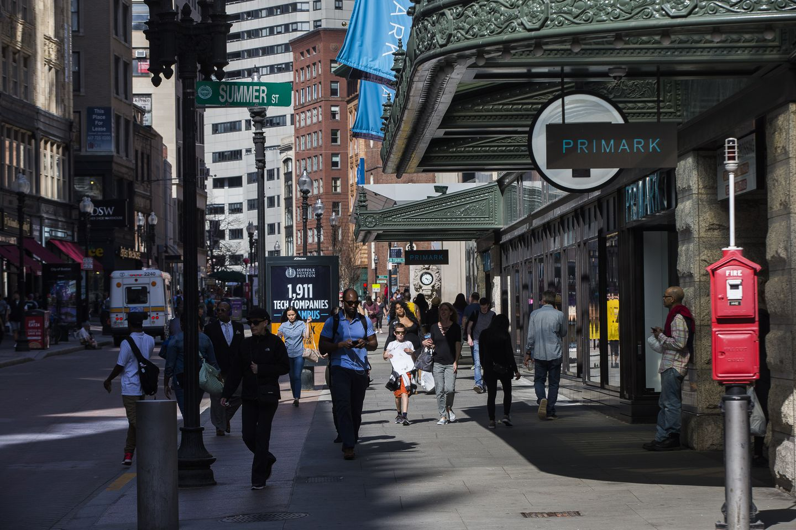
*Downtown Crossing in Boston*

It was the first time I had ever been self-employed.

Like many a neophyte freelancer, I did not handle the transition well. 

My schedule slipped later and later, until eventually I was sleeping after the sun had come up. I felt disconnected from the outside world, and disconnected from reality. 

One day the big, flashing alert lights went off in my brain: "SOMETHING IS WRONG". I realized that my mood had been getting progressively worse without me even noticing, very much like the boiling frog metaphor.

I wrote a note to myself: "Do something SOCIAL, and get out into the SUN EVERY DAY."

The next day, I decided I wanted to be a portrait artist, like the ones I used to see as a kid in Times Square. It checked both boxes.

I biked down to Harvard Square and picked up:
- Two camping seats. One for me, one for my customer.
- A tripod, to hold up my advertisement.
- A drawing pad, 18" x 24". Not for drawing, but to scribble something on to use as my ad.
- A sharpie. I don't like fancy pen, they make me too precious.
- A bucket hat and sunscreen.

That afternoon, I stepped out of the Red Line Station into Boston's Downtown Crossing. And so began my life as a street artist.

## FAQ

**How much money can you make in a day? A month?**

I initially charged $10/portrait with "suggested donation" messaging. From the beginning I noticed some kind of [pareto principle thing](https://www.8020curve.com/instructions.html) going on, where a good fourth of customers were giving me $20s.

If we ranked people by the amount they would pay for a portrait using a power-law probability distribution based on the 80-20 rule, we'd see something like this:

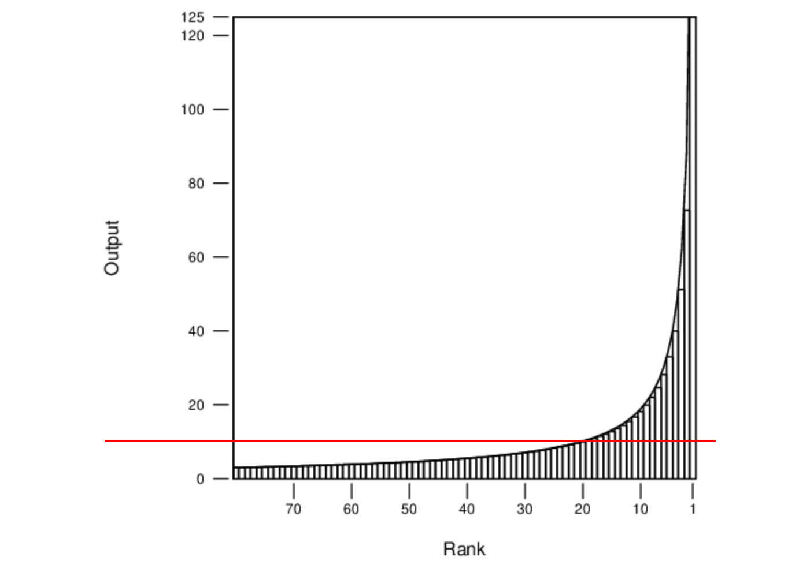
*Not based on any data, only a rough intuition of what was going on, take it as you will.*

As you can see, most people fall below my "donation" floor of $10, shown in red...hypothetically these people could get their portraits drawn, pay less than $10 or not pay anything, but experience the "bad samaritan emotional guilt tax". **Nobody did this,** so it's clear the emotional tax is greater than any benefit the art could provide. We'll ignore everyone below $10, thinking of them as disinterested.

Because there is no upper bound on donations, the people who absolutely love the experience/result can end up paying much more (my Rank 1 customer in real-life paid $100).

If we average out paying customers with this model, I'm getting $16.50 per portrait. 
 
One day I timed all of my portraits - the average came to 9 minutes and 27 seconds. Given some chit-chat time for every customer, this caps me at roughly 4 portraits per hour, or $68/hour...assuming that I'm working at high speed and people are lining up to get drawn.

But people aren't lining up to be drawn. 

This was the main challenge. The best street performers are fixated on volume. If you've ever seen an NYC breakdancing group, you'll know that crowds draw crowds. And what better way to get a crowd that insert yourself into one that already exists?

My "act" isn't performative, or I didn't invest the time to make it so. The most people I had watching was probably 10. The key is to always have somebody lined up, because social proof matters a ton. 

But anyways. I'll stop rambling. Here are some stats from week 1:

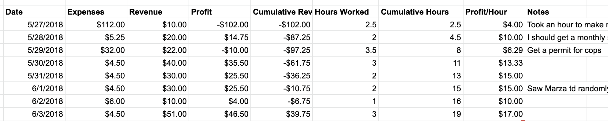
*Week 1*

Not so great, huh? I was bummed too. 

Here's week 6:

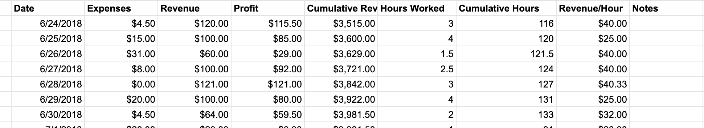
*Week 7*

A lot better!

Short answer: I was able to cover all of my living expenses. To put this in context, I lived in Cambridge, an area above Boston metro known for having some nice colleges and its [high cost of living](https://www.rentjungle.com/average-rent-in-cambridge-rent-trends/)!

Longer answer: I was surprised that after the first week I was making a livable income. After I had learned my initial lessons though, my hourly revenue didn't change very much. By FAR the most meaningful change I made was upping my suggested donation from $10 to $20, and using a thicker, more official looking card-stock material.

I also acknowledge there were a number of optimizations I could have made. A larger, printed sign. More examples of my work. Portraits on canvases that could sell for $40. Mass-produced pop art canvases on the side. I wanted to stay light though, so I go move around and do things after I was done working. That meant everything had to fit in my bag. 

One could argue that you don't do something like this for the money. From talking to the other street performers though, I get the sense that it is purely for the money, because it allows them pursue their art on the side without the obligation of employment. This brings me to the next question:

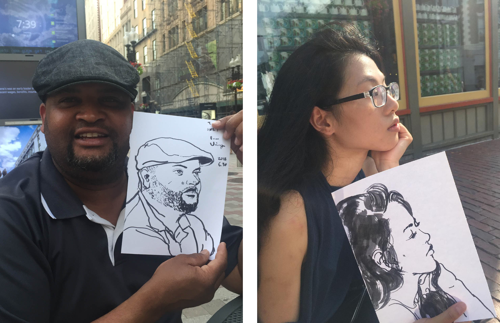

**What kind of people do you meet?**

I would frequently see [The Human DJ](https://www.instagram.com/thehumandj/), one of the more popular street performers in Boston. He told me it was the quickest way to make money for now, and as soon as he saved enough, he would leave Boston and produce music full time (EDIT: As of 2019, he's moved to Atlanta and is doing this exactly). He's had a lot worse experiences than me because he's been doing this for so long, like getting shut down by police and getting robbed.

[Mr. Not Art](http://www.mettermedia.com/not-art-x-metter-media-interview/) was a grafitti artist. He sold his prints on the street while working on his own pieces in the meantime. He's been doing the same concept for 7 years now, and is having a hard time coming up with something new.

Ming doesn't have an online presence, but at one point I'd stop by and talk to him every day. He's one of those OG graduates of the Central Academy of Fine Art in Beijing, with a degree in Oil Painting. He works on his own paintings in the winter and draws realistic pastels of children in the summer. He's not too invested in his own work though. He just likes being able to go home when he wants to and the fact that MassHealth is so cheap.

They were free spirits. Not in the sense that they were extraordinarily bohemian; more in that most of them would rather be paid less and respected less and than relinquish any control of their financial destinies to employers. I thought many had great business acumen.

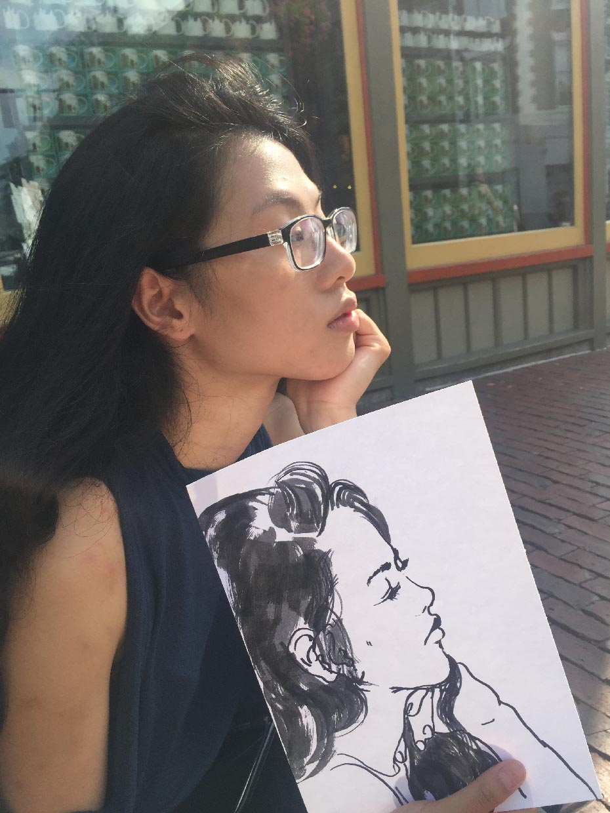

**Who gets their portrait drawn?**

My drawing style wasn't popular with the tourist families. My audience skewed towards younger - lots of high schoolers and college students. A lot of people with creative, niche interests. A lot more locals.  Otherwise, I got a fairly even split of gender and race.

I had lots of people who said they liked to draw too and wished they kept at it.

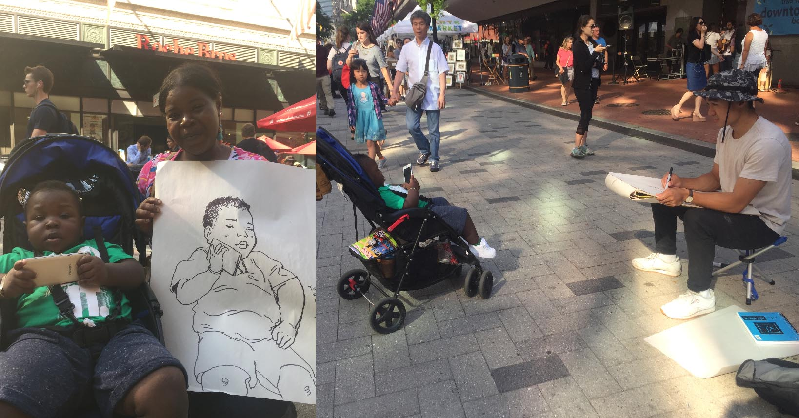

**Anything weird happen?**

Oh gosh. Lot of weirdos. Lot of nice weirdos too. But lots of weirdos. Some kids who worked at the Downtown Crossing Primark would stop by every day and shill for me. They were fun.

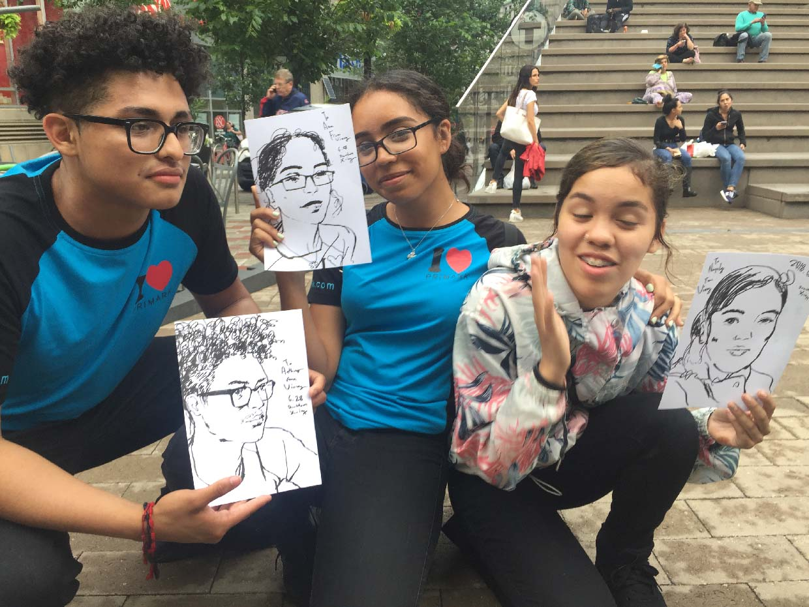

**Was it enjoyable?**

I liked talking to people about their days and their lives. 

I didn't actually like doing the actual portraits. 

It's mentally taxing to go for accuracy with a time constraint. An arbitrary comparison for non-artists is to think of somebody timing you while you line up a 10x10 grid of wine-bottles as perfectly as possible. Then, repeat this many times.

I thought of it as technical training, which made the whole thing go more smoothly. 

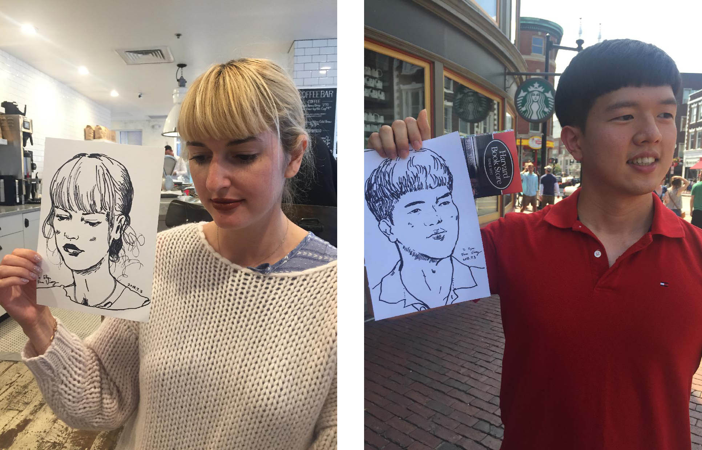

**Worst Experience?**

Teenagers on dirtbikes hanging out on the street all evening and scaring all my customers away with the noise.

Honestly, nothing that was too bad. I had a lot stranger experiences when <a class="underline black" href="{{site.baseurl}}/vignettes/">hitchhiking</a>.

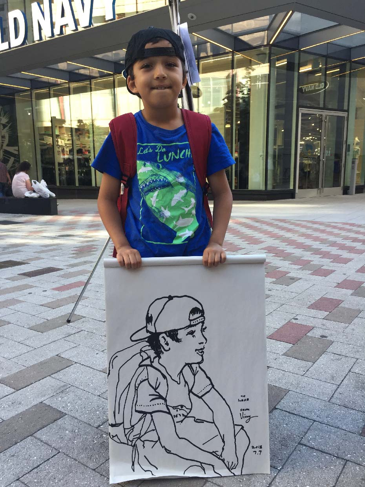

**Any tips for aspiring street artists? Or for your former self?**

Experiment with times and locations. I thought I would to better in Faneuil Hall, Boston's most touristy spot, but I rarely got any customers when I set up there (there was also more established competition).

The weekend evenings worked best for me. This was when things were slowing down, and it was starting to get dark. Thursdays were always better than Fridays - I think people chill out on Thursdays, but are too eager to get drunk on Fridays.

I realized that my mood would get lower when I went for long stretches without getting customers. I told myself that it was okay to take a break, buy some water, sit down, and do some light sketching while I got my energy back. I found that chatting with strangers without the intent of drawing them always boosted my mood. Your mood is important because it's most of the reason why people want or don't want to engage with you!

It's very empowering to realize that you can make money completely independently, and with a creative skill nonetheless. So yes, hone your craft, but more importantly, work on your sales, because that'll account for 80% of your results.

And don't forget:

You're like a bus driver. You're aren't really a part of the lives of any of your passengers. You can however, make their days.

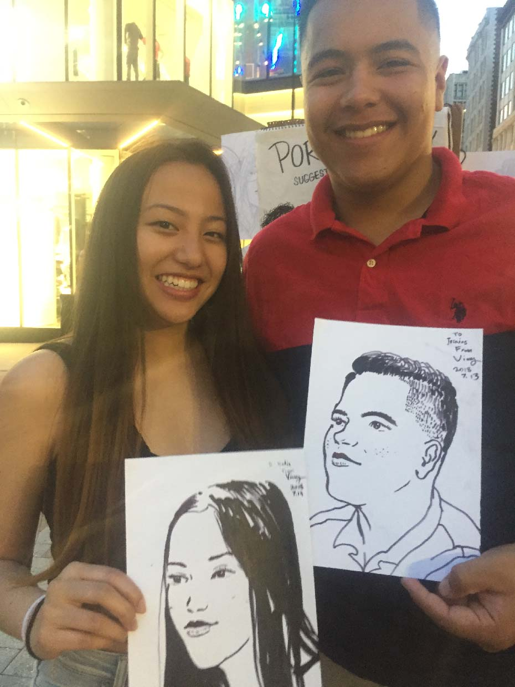

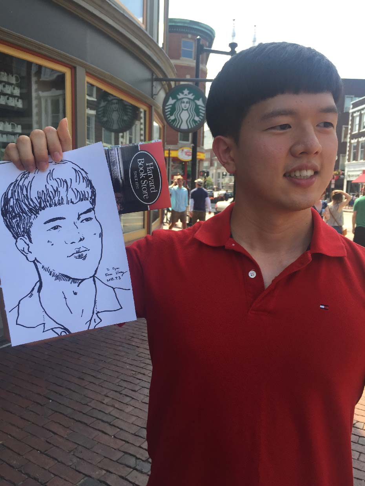

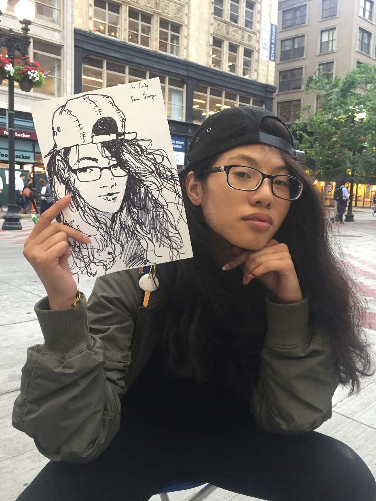

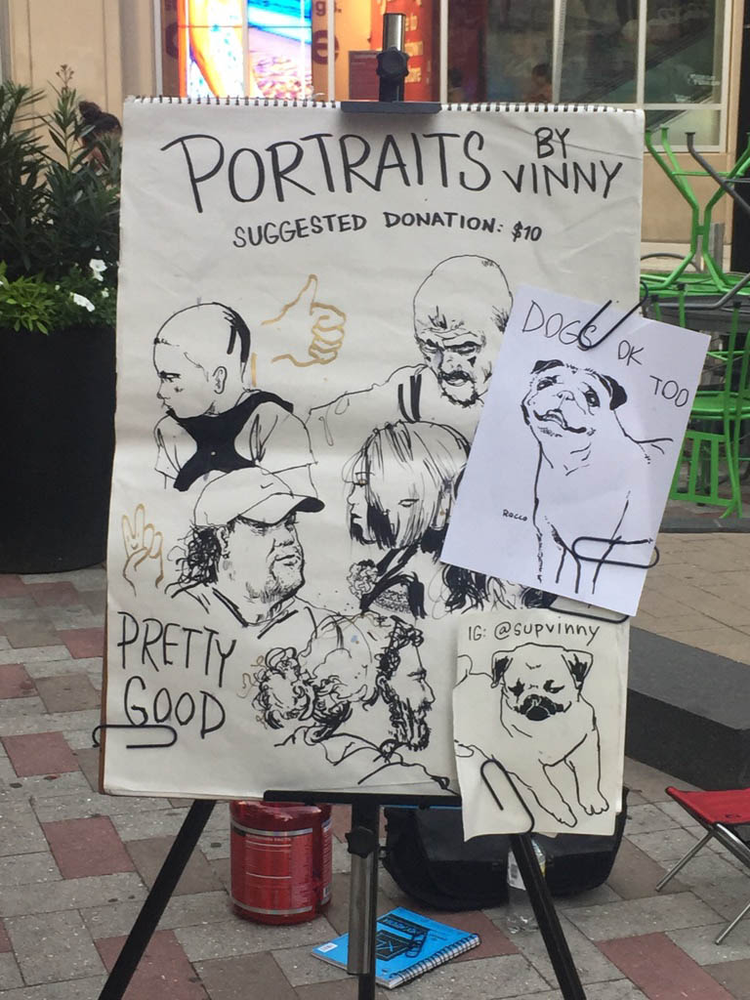
*For some reason, I was "Vinny" out there. Here's my dinky little sign: you can SEE how under-marketed I was, and what a change that would have made to the bottom line!*
